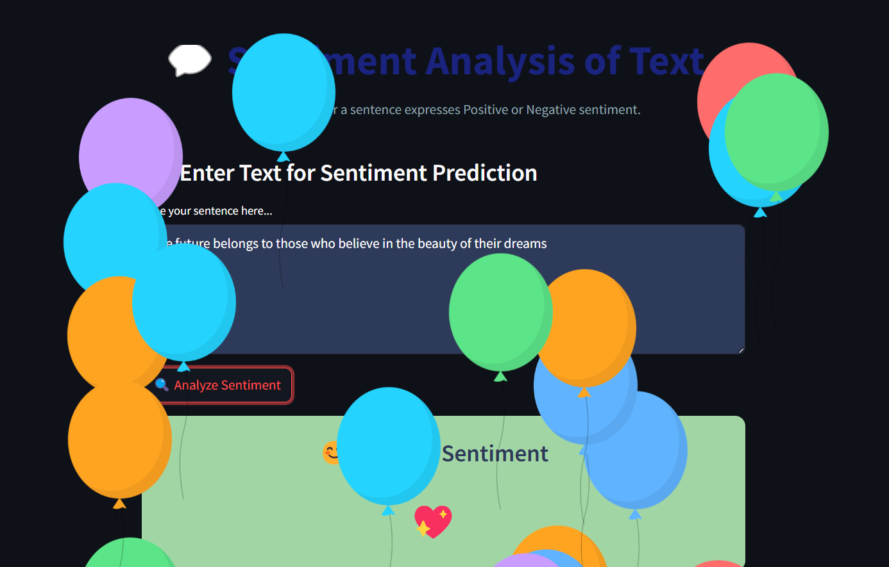

# 💬 Sentiment Analysis Web App

This is a **Sentiment Analysis Web Application** built with **Streamlit**, designed to classify movie reviews as either **positive** or **negative**. It uses **Logistic Regression** and **TF-IDF Vectorization** trained on the [IMDb Movie Reviews Dataset](https://www.kaggle.com/datasets/lakshmi25npathi/imdb-dataset-of-50k-movie-reviews).

---

## 🚀 Features

- 📝 Clean and styled user interface using Streamlit
- 🔍 Predicts sentiment from user input text
- 🎈 Displays result with emojis, background colors, and animations (balloons)
- 💖 Custom CSS for interactive design and text area styling
- 📦 Model training script with preprocessing, TF-IDF, and Logistic Regression

---

## 📁 Dataset

- **Source:** [IMDb Movie Reviews Dataset on Kaggle](https://www.kaggle.com/datasets/lakshmi25npathi/imdb-dataset-of-50k-movie-reviews)
- **Size:** 50,000 reviews labeled as "positive" or "negative"

---


## 🚀 What I Did in This Project

- Cleaned and preprocessed IMDb movie reviews dataset
- Transformed text data into features using **TF-IDF vectorization**
- Trained multiple models: **Logistic Regression** and **Multinomial Naive Bayes**
- Selected **Logistic Regression** as the best-performing model (~85% accuracy)
- Pickled the model and vectorizer for efficient reuse
- Developed an interactive **Streamlit app** with styled UI and emoji-based feedback
- Deployed a clean interface that reacts with animations (balloons, hearts) on prediction

---

## 🖥️ Tech Stack

- Python
- Scikit-learn
- Pandas, Numpy
- Matplotlib, Seaborn (for evaluation plots)
- Streamlit (for UI)

---  
## 📷 App Preview


---

## 📁 Repository Structure
```
├── app.py                 # Streamlit Web App
├── text_sentiment_analysis_using_ml.ipynb         # Data preprocessing and model training
├── log_reg_model.pkl      # Trained Logistic Regression model
├── nb_model.pkl           # Trained Naive Bayes model (optional)
├── vectorizer.pkl         # TF-IDF Vectorizer
├── IMDB Dataset.csv       # Dataset (add to .gitignore if large)
├── README.md              # Project documentation
├── requirements.txt       # List of dependencies
└── images/                                        # Project documentation
```


